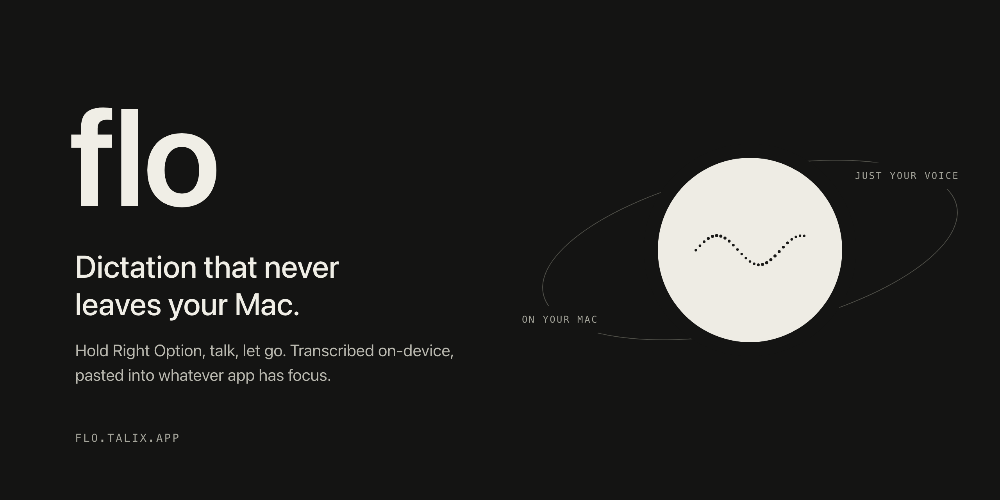

<p align="center">
  
</p>

<p align="center">Push-to-talk dictation for Apple Silicon Macs. Fully on-device.</p>

<p align="center">
  <a href="https://flo.talix.app">flo.talix.app</a> ·
  <a href="https://github.com/dev-talix/flo/releases/latest">Download</a> ·
  <a href="SECURITY.md">Security</a>
</p>

Hold a key, speak, let go. Flo pastes the text into the focused app.
[WhisperKit](https://github.com/argmaxinc/WhisperKit) or Parakeet via
[FluidAudio](https://github.com/FluidInference/FluidAudio) transcribes on-device,
with optional cleanup by a local LLM. No audio leaves your Mac.

## Requirements

- Apple Silicon Mac (M1 or later). Intel isn't supported.
- macOS 14 or later. Apple Intelligence cleanup and command mode need macOS 26.
- About 2 GB for the model cache. Default Large v3 Turbo is about 1.5 GB.
- Internet on first launch only, to download the model.

## Install

Download `Flo-<version>.dmg` from the [releases page](../../releases)
and drag Flo to Applications. Builds are signed and notarized.

On first launch, grant two permissions:

1. **Microphone**, to record while you hold the key.
2. **Accessibility**, for the global hotkey and synthesized paste. The menubar
   warns until it's granted. No relaunch needed.

Model download and Core ML preparation can take a few minutes. The menubar then shows Ready.

Flo lives in the menubar and starts at login. Its dots form a still wave when
ready, move while you talk, and fill in while transcribing. Daily updates use
[Sparkle](https://sparkle-project.org); you can turn them off in Settings.
To uninstall, quit Flo, delete the app, and delete `~/Library/Application Support/LocalFlow/`.

Flo was LocalFlow before 1.8.0, then Walkie until 1.10.0.
[Upgrades](docs/development.md#app-naming-and-upgrades) keep settings, permissions, and data.

To check a download came from this repo's release workflow:

```bash
gh attestation verify Flo-<version>.dmg --repo dev-talix/flo
shasum -a 256 -c SHA256SUMS.txt   # attached to each release
```

## Using it

Hold **Right Option**, speak, release. **Escape** cancels before the text is ready.
Change the hotkey, speech model, microphone, and HUD theme in Settings.

- **Live transcript.** Finished chunks appear in a panel above the HUD while you talk.
  This text is raw; Flo pastes the final text after release.
- **Formatting.** Long pauses start paragraphs; "first... second..." makes
  numbered lists. Say "new line", "new paragraph", "bullet point", "numbered
  list", or "thumbs up emoji". Commands always apply, even mid-sentence.
- **Vocabulary and corrections.** Add names and jargon in Settings to guide Whisper.
  Teach fixes like "talex" to "Talix", or edit and copy a pasted dictation,
  then pick **Fix Last Dictation...** to learn the swaps.
- **Snippets.** Say a trigger phrase and it's replaced with saved text.
- **History.** Every dictation goes in a daily Markdown file under
  `~/Library/Application Support/LocalFlow/History/`. Copy the last 5 from the menu.
- **Retry.** After a failed transcription, retry from the menu. Audio stays in memory until you quit.

### Cleanup (optional)

Cleanup strips fillers, fixes false starts, and adapts to the app: casual in
Slack, identifier-safe in editors. It's off by default because it adds latency.
It uses Apple Intelligence when available, otherwise [Ollama](https://ollama.com)
with Superwhisper's [s1-mini](https://huggingface.co/superwhisper/s1-mini):

```bash
brew install ollama
brew services start ollama
./scripts/setup-s1-mini.sh   # also attached to each release
```

If the cleanup backend is down, Flo pastes the raw transcript.

### Command mode

Hold the command key and ask to rewrite selected text: "make this shorter" or
"translate to Spanish". With no selection, Flo writes at the cursor. It uses Apple
Intelligence or a local Ollama instruct model, `gemma3:4b` by default.

## Privacy

There's no account, server, or telemetry. Flo's only network requests on its own
are model downloads and enabled update checks. The hotkey monitor sees modifier
keys only, never characters. Diagnostic recordings are off by default and stay local. See
[SECURITY.md](SECURITY.md) for details and how to report a vulnerability.

## Limitations

- Whisper models are English-only by default.
- In password fields, Flo types instead of pasting, and some apps
  ignore synthesized keystrokes. Escape doesn't work there either.
- Recordings stop at 5 minutes.

## Development

See [docs/development.md](docs/development.md) for builds, the local test channel,
diagnostics, and benchmarks. Feature notes live in [docs/flows](docs/flows).

See [Releases](docs/development.md#releases) for the release flow and required secrets.

## License

MIT. See [LICENSE](LICENSE).
